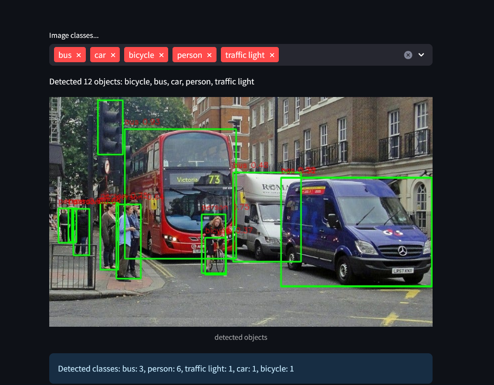

#  YOLOv11 Object Detection App with Streamlit

This is a simple web app built using **Streamlit** and **YOLOv11 (Ultralytics)** for performing real-time object detection on images and videos.



---

##  Features

-  Upload **images** and detect objects with bounding boxes
-  Upload **videos** and run frame-by-frame detection
-  Filter detected objects by class
-  Download the processed video with detections
-  Progress bar and frame counter for video processing

---

##  Tech Stack

- [Streamlit](https://streamlit.io/)
- [YOLOv11 by Ultralytics](https://docs.ultralytics.com/)
- [OpenCV](https://opencv.org/)
- [Python](https://www.python.org/)

---

##  Installation

1. **Clone the repo**:
   ```bash
   git clone https://github.com/salmaamohamed/object-detection-app.git
   cd object-detection-app

2. **Install dependencies**:
   
    pip install -r requirements.txt

# Usage
    streamlit run object_detection.py

salmaa mohamed

AI/ML & Computer Vision Engineer

vsalma.mohamed24@gmail.com